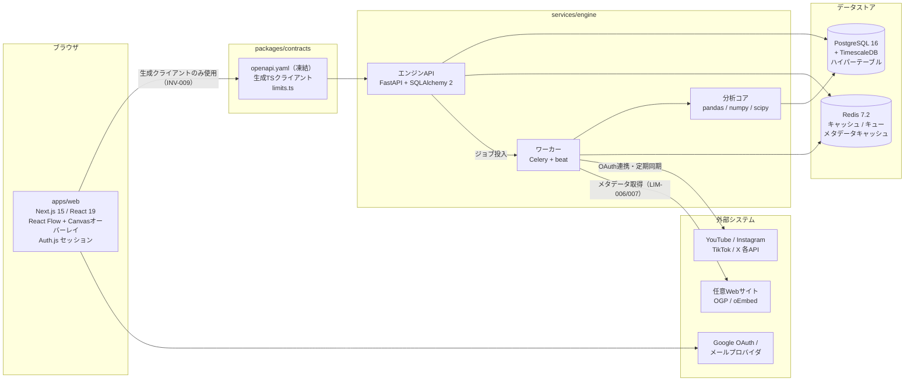

# Cross-SNS Audience Flow Analyzer 仕様書 v1.1

## 1. 文書概要

### 1.1 文書目的
本仕様書は、複数のSNSアカウントおよび任意URLを接続し、プラットフォーム間の流入・流出の関係を**ネットワーク図**として可視化するWebアプリケーション **Cross-SNS Audience Flow Analyzer** の完成仕様を定義するものである。

本書 v1.1 は v1.0 を置き換える（supersede）。v1.0 で「候補」「推奨」「等」として保留されていた技術・設計判断をすべて確定し（各所に【v1.1確定】と明記）、確定スタック・システム構成・データモデル・API設計・SNS API制約・UIデザインシステム・開発工程・機械可読仕様との対応を新章（第22章〜第29章）として追加した。

### 1.2 本書と機械可読仕様（specs/）の関係
実装の**正本（canonical）は `specs/` 配下の英語仕様群**である。本書はその人間可読コンパニオンであり、背景・意図・全体像を日本語で提供する。両者に不一致がある場合は `specs/` が優先し、本書を追随修正する。数値上限はすべて `specs/05_limits.md` の LIM-ID が単一の出典であり、本書中の数値には対応する LIM-ID を併記する。未決事項は `specs/08_decisions.md` の OPEN-ID で追跡する。詳細は第29章。

### 1.3 プロダクト目的
本アプリは、ユーザーが保有するSNSアカウントや任意のWebページを接続し、以下を実現する。

- SNS間およびSNS→任意サイト間の流入関係を可視化する
- 投稿単位・アカウント単位・URL単位で流入寄与を分析する
- 複雑な流入構造を、**直感的なネットワークグラフUI**で理解可能にする
- ノード配置、接続、切断、フィルタ設定などを**視覚操作中心**で行えるようにする
- 数値だけでなく、**Flowアニメーション**により流入の方向・強さ・変化を背景表現する

### 1.4 想定ユーザー
- 個人クリエイター
- YouTuber / TikToker / Instagram運用者
- 個人EC運営者
- ToProレベルの小規模ブランド
- 複数SNSを運用している個人事業主
- 自サイトや商品ページへの導線分析を行いたいユーザー

### 1.5 改訂履歴
| 版 | 日付 | 内容 |
|---|---|---|
| v1.0 | - | 初版。機能・UI・分析ロジックの完成仕様を定義。技術構成は候補提示に留まる |
| v1.1 | 2026-08-29 | 技術スタック・アーキテクチャ・デザインシステムを確定。第22〜29章を追加。`specs/`（英語）を実装正本と定義 |

---

## 2. プロダクト定義

### 2.1 プロダクト名
Cross-SNS Audience Flow Analyzer
（仮称）

### 2.2 提供形態
- **主要提供形態：Webアプリ**（クラウドデプロイ、コンテナ運用）【v1.1確定】
- デバイス対応：PCブラウザを主対象
- サブ対応：タブレット / スマートフォンブラウザ（閲覧・軽操作）。3ペインを維持できる最小幅は 1024px（LIM-019）で、それ未満ではサイドペインをドロワー化する【v1.1確定】
- 将来的にPWA対応を行う

### 2.3 コアコンセプト
「SNS・URL・ページ・アカウント・動画・商品ページなどをノード化し、流入の関係を線とアニメーションで可視化する、視覚中心のAudience Flow分析アプリ」

---

## 3. 主要要件

### 3.1 主要機能一覧
1. SNSアカウント連携
2. 任意URL登録
3. URL解析によるノード自動生成
4. ドラッグ＆ドロップによるノード配置
5. ノード間接続線の自動推定表示
6. 接続線の手動接続・切断・再接続
7. 流入人数 / 流入率 / 信頼度の表示
8. 流入条件フィルタ
9. Flowアニメーション表示
10. 時系列・期間別再計算
11. ノード種別ごとの専用表示スタイル
12. ネットワーク全体の視認性最適化
13. 分析結果詳細パネル
14. 保存・再読込
15. プロジェクト管理

### 3.2 優先順位
機械可読仕様では priority（MUST/SHOULD/COULD）と phase（r1/later）で管理する。対応は次のとおり。

- **最優先（MVP必須 = r1 / MUST）**
  - YouTube / Instagram / TikTok / X 連携
  - 任意URL登録
  - ノード生成
  - グラフ表示
  - 自動接続線生成
  - ドラッグ＆ドロップ配置
  - 接続線の接続 / 切断
  - 流入人数 / 流入率表示
  - Flowアニメーション
- **次優先（r1 / SHOULD または later / SHOULD）**
  - ノード詳細分析
  - 保存、プロジェクト共有
  - 異常検知
  - 時系列比較
- **将来拡張（later / COULD）**
  - Shopify / BASE / Etsy などEC連携
  - レポート生成
  - 通知
  - モバイル最適化強化

※ X 連携は API ティア未決（OPEN-001）により、r1 では Estimated 専用または対象外となる可能性がある（第26章参照）。

---

## 4. 対象SNS・対象ノード

### 4.1 初期対応SNS
- YouTube
- Instagram
- TikTok
- X

各プラットフォームのデータ取得能力（Observed / Estimated 区分）と制約は第26章で確定する。

### 4.2 URLから生成されるノード種別
URLが入力された際、システムはURLを判定し、種別ごとに適切なノードを生成する。

#### 4.2.1 SNS系
- YouTubeチャンネルURL
- YouTube動画URL
- YouTubeショートURL
- InstagramプロフィールURL
- Instagram投稿URL
- InstagramリールURL
- TikTokプロフィールURL
- TikTok動画URL
- XプロフィールURL
- X投稿URL

#### 4.2.2 任意URL系
- 商品ページ
- トップページ
- ランディングページ
- ブログ記事
- 予約ページ
- ポートフォリオページ
- Discord招待URL
- GitHubリポジトリ
- その他一般Webページ

### 4.3 ノードスタイル方針
視認性重視のため、ノードは統一ルールのもとでタイプ別に明確に差別化する。

#### 4.3.1 共通方針
- ベース形状は丸角カードまたは円形バッジ
- 一目で判別できるアイコン表示
- ラベルは短く明瞭に
- 色・形・情報密度を種別ごとに最適化
- 過剰な情報はノード内に詰め込まず、詳細はサイドパネルへ委譲
- 種別の判別は色だけに依存させず、アイコン・形状・ラベルでも判別可能にする（INV-003、WCAG 2.2 SC 1.4.1 準拠）【v1.1確定】

#### 4.3.2 ノード種別と見た目
- **SNSアカウントノード**
  - 大型ノード
  - プラットフォーム色を基調（テキストコントラストは 4.5:1 以上を維持、LIM-017）
  - アイコン + アカウント名 + フォロワー数/登録者数
- **SNS投稿ノード**
  - 中型ノード
  - サムネイルまたは簡易ビジュアル
  - 投稿タイトルまたは先頭テキスト
  - 投稿日、再生数等を簡略表示
- **動画ノード**
  - 再生ボタンアイコン
  - 動画サムネイル強調
- **任意URLノード**
  - 統一スタイル
  - ドメイン名 + ページタイトル
  - シンプルな矩形カード
- **商品ページノード**
  - 価格や商品画像を小さく表示できる拡張型
- **Webサイトトップノード**
  - ドメイン主表示
  - 全体入口ノードとして扱う

サムネイル未取得時は種別アイコンとドメインラベルで代替表示する【v1.1確定】。

実装上、各ノード種別は React Flow のカスタムノードコンポーネントとして実装する【v1.1確定】（第22章）。

---

## 5. UI/UX仕様

### 5.1 UIコンセプト
本アプリのUIは、**分析ダッシュボード**であると同時に、**流入関係を直感理解できる視覚マップ**である必要がある。
そのため、一般的な表やチャートよりも、**ネットワーク図の主画面**を中心に設計する。

デザインシステムは「calm instrument（静かな計器）」を基調とする【v1.1確定】。詳細は第27章。

### 5.2 画面構成
画面は以下の3ペイン構成を基本とする（最小幅 1024px、LIM-019。それ未満ではドロワー化）。

#### 5.2.1 左ペイン：ノードソース / 入力エリア
- SNS連携一覧
- URL入力欄
- 登録済みノード一覧
- ノード検索
- フィルタテンプレート
- 新規ノード生成

#### 5.2.2 中央ペイン：メインネットワークキャンバス
- ネットワーク図表示
- ノード配置操作
- 接続線表示
- Flowアニメーション
- ズーム / パン
- 複数選択
- 簡易ツールバー

#### 5.2.3 右ペイン：詳細 / 分析パネル
- 選択ノード詳細
- 選択接続線詳細
- 流入人数
- 流入率
- 時系列推移
- 信頼度
- 再計算情報
- フィルタ設定
- 接続条件設定

#### 5.2.4 上部バー
- 期間選択・フィルタ・保存状態表示・再計算状態表示【v1.1確定】

---

## 6. URL入力とノード生成仕様

### 6.1 URL入力方法
ユーザーは左ペインの入力欄へURLを貼り付ける。

### 6.2 URL解析処理
URL入力時、システムは以下を実行する。

1. URL正規化
2. ドメイン判定
3. パス判定
4. SNS種別判定
5. リソース種別判定（アカウント / 投稿 / 動画 / 一般ページ）
6. メタデータ取得
7. ノード型決定
8. ノード生成

### 6.3 メタデータ取得【v1.1確定】
- 取得はすべて**サーバーサイド**で実行する（対象サイトへのアクセスをクライアントから行わない）
- OpenGraph を第一とし、oEmbed をフォールバックとする
- タイムアウトは 5秒（LIM-006）。超過時は仮ノードを生成し、後から再取得可能とする（§18.3）
- 取得結果は Redis に 24時間（LIM-007）キャッシュし、同一正規化URLの再要求は対象サイトへアクセスしない
- robots の意向を尊重した取得とし、送信リンク先のクロール（リンク追跡）は行わない

### 6.4 自動生成される情報
- タイトル
- サムネイル
- ドメイン名
- 種別
- URL
- プラットフォーム
- 表示名
- 推定分析可能範囲
- ノードカテゴリ

### 6.5 ノード生成後の挙動
- ノードは左ペイン内の「未配置ノード一覧」に追加される
- ユーザーはドラッグ＆ドロップで中央キャンバスへ配置する
- キャンバスに配置された時点で分析候補となる（未配置ノードは再計算の対象外）
- 配置変更ごとに視覚レイアウトが更新される

---

## 7. ネットワークグラフ仕様

### 7.1 ノード配置
- ユーザーはノードを自由にドラッグできる
- スナップ機能はオプション
- オートレイアウトと手動レイアウトを切替可能
- ノードは重なり回避を行う
- 配置変更に応じて接続線が再描画される

グラフ描画基盤は **React Flow（@xyflow/react v12）** に確定する【v1.1確定】（Cytoscape.js は不採用。第22章・第29章の decisions 参照）。オートレイアウトのアルゴリズム選定（dagre / elkjs / d3-force）は重なり回避要件との適合検証待ちで未決（OPEN-004）。

### 7.2 自動接続
キャンバスにノードが配置されると、システムは関連性推定を行い、自動で接続線を表示する。

#### 7.2.1 自動接続条件例
- 流入人数が設定閾値以上
- 流入率が設定閾値以上
- 信頼度が設定閾値以上（既定値 0.3、LIM-013。プロジェクト単位・接続線単位で変更可能）【v1.1確定】
- 時系列相関あり
- URL参照関係あり
- SNS連携に基づく分析可能性あり

### 7.3 接続線の意味
接続線は「AからBへの推定または観測された流入」を表す。すべての接続線は起点ノード・終点ノード・期間・種別（Observed / Estimated）・信頼度の5要素を必ず保持する（INV-002）【v1.1確定】。

#### 7.3.1 線の表現要素【v1.1確定】
- 太さ：流入量
- 不透明度：信頼度
- アニメーション速度・明度：流量・強度
- 矢印方向：流入方向
- **Estimated は破線＋彩度低下＋「Estimated」ラベル**で表現し、色相のみによる区別は行わない（INV-003）。Observed の線色にはアクセントのシアンを使用する（第27章）

### 7.4 接続線の表示情報
ホバーまたは選択時に表示：

- 人数
- 割合
- Confidence
- 流入種別（Observed / Estimated）
- 期間

---

## 8. Flowアニメーション仕様

### 8.1 目的
流入の「方向」「強さ」「動き」を視覚的に理解させるため、接続線上および背景にFlowアニメーションを表示する。

### 8.2 実装方式【v1.1確定】
- React Flow の SVG エッジ上に**Canvas 2D オーバーレイ**を重ね、粒子（パーティクル）をエッジのベジェパスに沿って描画する（SVG/DOM アニメーションは不採用。WebGL/3D パーティクルは r1 対象外）
- 粒子は描画単位であり、それ自体はデータを持たない

### 8.3 表現方針
- 接続線上を粒子または光が流れる
- 流量が多いほど粒子密度を増やす
- 強い流入ほど速度や明度を上げる
- 信頼度は粒子の不透明度に対応させる
- 変化量が大きい場合は脈動表現を行う
- 再計算による値の変化は瞬時置換ではなく補間アニメーションで遷移させる

### 8.4 背景表現
- 背景にもわずかな流れのニュアンスを入れる
- ただし情報可読性を最優先し、背景は控えめにする
- 背景演出はON/OFF可能

### 8.5 視認性・性能制約【v1.1確定】
- アニメーションは装飾ではなく情報表現である
- 過剰な発光やノイズは禁止
- ノードラベルと数値を読めることを最優先とする
- 粒子総数の上限は 2,000（LIM-016）
- フレームレートを常時監視し、目標 60fps（LIM-003）。30fps（LIM-004）を継続的に下回った場合、段階的に品質を落とす：粒子数削減 → 最低品質では静的な方向破線に置換。回復時は1段階ずつ復元する
- OS の prefers-reduced-motion 設定時は連続的な粒子運動を停止し、静的な方向表現（矢印・太さ）に切り替える
- アニメーション強度設定と背景演出のON/OFFトグルを設定画面に用意する
- アニメーション無効時も、方向は矢印、流量は太さで伝達される

---

## 9. 接続線の手動編集仕様

### 9.1 手動接続
ユーザーはノードから別ノードへドラッグすることで、接続線を作成できる。同一の起点・終点・期間の接続線が既に存在する場合は作成を拒否し、既存線をハイライトする【v1.1確定】。

### 9.2 手動切断
- 接続線選択後、削除操作で切断
- 右クリックメニューから切断
- Deleteキー対応
- 削除後は自動再計算を実行する

### 9.3 再接続
- 接続線の端点をドラッグして別ノードへ付け替え可能
- 付け替え後、自動再計算を実行する

### 9.4 手動接続線の扱い
手動接続は2種類に分かれる。

- **分析補助接続（Analysis-assist edge）**
  - ユーザーが「関係がありそう」と仮置きする線
  - 再計算対象となり、表示閾値の適用を受ける
- **固定接続（Pinned edge）**
  - 常に表示したい線
  - 自動非表示・再計算による削除の対象外（INV-006）【v1.1確定】

### 9.5 接続線作成時の設定
接続線作成時に以下を設定可能とする。

- 流入人数閾値
- 流入率閾値
- 信頼度閾値
- 表示期間
- 自動更新有無
- 接続線の種類（分析補助 / 固定）

---

## 10. 分析ロジック仕様

### 10.1 分析種別
- Observed Flow：プラットフォームが報告するトラフィックソースデータに基づく流入。推測は含まない
- Estimated Flow：時系列ラグ相関と投稿イベントから推定する流入。常に「Estimated」ラベル付きで表示

どのプラットフォームがどちらを提供できるかは第26章で確定する。

### 10.2 Observed Flow
直接観測できるデータに基づく流入。

- SNS内部のクリック・外部流入元（例：YouTube Analytics の insightTrafficSourceType）
- 連携APIから取得できる指標
- URLアクセスデータ（将来：自サイト計測スクリプト）
- ECイベント（将来）

### 10.3 Estimated Flow【v1.1確定】
以下の要素を組み合わせて推定する。

- 投稿時刻
- 再生数時系列
- フォロワー増減
- プロフィールアクセス
- クリック増加
- 他ノードの時系列変化
- 投稿内容の類似性
- 過去傾向
- ラグ推定
- 相関推定モデル

推定の確定パラメータ：

- 2ノードの重複時系列が **8点以上**（LIM-014）ある場合のみラグ相互相関を計算する。不足時は自動接続線を生成せず、理由を記録して詳細パネルに表示する
- ラグ探索窓は最大 **72時間**（LIM-015）。クロスSNSの参照効果は数日で減衰するため、これを超える窓は偽陽性を増やす
- Confidence は 0〜1 の範囲で、データ完全性・相関強度・ラグの妥当性から算出し、すべての接続線に付与する
- 相関強度から推定人数（絶対数）への換算方法（率のみ表示か、モデル化した人数か）は未決（OPEN-005）
- 結果は常に「推定」として報告し、因果の保証はしない
- 再計算は冪等である：同一入力（ノード・接続線・期間・閾値・時系列）から同一結果を得る（INV-007）

### 10.4 再計算トリガー
以下の操作時に自動再計算を行う。

- 新規ノード配置
- 接続線作成
- 接続線切断
- ノード削除
- 期間変更
- 閾値変更
- フィルタ変更
- 連携データ更新

トリガーは **3秒**（LIM-009）のデバウンスで束ね、連続操作を1つのエンジンジョブに合流させる【v1.1確定】。

### 10.5 再計算のユーザー体験
- 再計算中は軽量な進行表示を出し、前回の接続線は表示したまま維持する
- 線の太さや数値が滑らかに変化
- 突然全消去ではなく、アニメーション遷移させる
- 変化の理由を右パネルに表示する
- 再計算失敗時は前回結果を保持し、stale（陳腐化）マーカーと失敗理由を表示する（INV-005）【v1.1確定】

---

## 11. フィルタ・表示制御仕様

### 11.1 接続線表示条件
以下の条件をユーザーが設定できる。

- 流入人数が N 人以上
- 流入率が X %以上
- Confidence が Y 以上（既定 0.3、LIM-013）
- Observed のみ表示
- Estimated のみ表示
- 特定期間のみ表示
- 特定ノード種別のみ表示

条件変更はページリロードなしで表示へ反映する。条件に合致する流入が1つもない場合も全ノードは表示したまま、「現在の閾値に合致する接続線がない」旨を明示する【v1.1確定】。

### 11.2 ノード表示条件
- 特定プラットフォームのみ
- 投稿ノードのみ
- アカウントノードのみ
- 任意URLノードのみ
- 商品ページのみ

端点が非表示になった接続線も同時に非表示にする（固定接続を除く）。

### 11.3 視認性補助
- ラベル表示の簡略化
- 小ノードの集約表示（表示ノード数が 100（LIM-001）を超えた場合、グループバッジへ集約）
- 線の束ね表示
- 混雑時のサブグラフ分割（将来拡張）
- 選択ノード周辺のみ強調表示（周辺以外を減光）

---

## 12. 詳細パネル仕様

### 12.1 ノード詳細
ノード選択時に表示する情報：

- ノード名
- 種別
- URL
- プラットフォーム
- サムネイル
- 基本指標
- 流入総量
- 流出総量
- 主な接続先
- 時系列グラフ（Recharts、数字は等幅タブラー数字）【v1.1確定】
- 関連投稿
- 更新時刻

選択期間に欠けている指標がある場合は、欠けている指標名とその原因（未連携 / 未取得 / 範囲外）を明示する【v1.1確定】。

### 12.2 接続線詳細
接続線選択時に表示する情報：

- 起点ノード
- 終点ノード
- 流入人数
- 流入率
- 信頼度
- データ種別（Observed / Estimated）
- 使用指標
- 時系列グラフ
- ラグ時間
- 変化要因の簡易説明（再計算ごとの変化理由を含む）

期間内にデータがない場合は、欠落を明示する設計済みエンプティステートを表示する。

---

## 13. プロジェクト管理仕様

### 13.1 プロジェクト
ユーザーは複数プロジェクトを作成できる。

例：
- メインSNS分析
- 商品A導線分析
- YouTube→EC流入分析
- キャンペーン別分析

プロジェクト・連携・時系列データは所有ユーザーのみが読み書きでき、他ユーザーからの参照は not-found として扱う（INV-004）【v1.1確定】。

### 13.2 保存内容
- ノード一覧
- ノード位置
- 接続線状態
- 表示条件
- 期間
- フィルタ
- 固定接続
- ノードグループ

保存形式は ProjectDocument 契約（CT-003）としてスキーマ・バージョン付きで定義する（第24章）。

### 13.3 オートセーブ【v1.1確定】
- 自動保存あり：最終変更から **5秒**（LIM-008）のデバウンス後に保存
- 手動保存可能
- 保存状態（保存済み / 保存中 / 未保存）を常時UI表示する
- 保存失敗時は未保存インジケータを表示し、変更をメモリに保持して次回変更時または手動保存で再試行する

### 13.4 共有・サンプルデータ
- プロジェクト共有（later / SHOULD）：読み取り専用リンクを発行する。連携クレデンシャルは一切露出しない。リンクは失効操作の時点から拒否される
- 初期画面の「サンプルデータで体験」に同梱するデータセットは未決（OPEN-003）

---

## 14. 非機能要件

### 14.1 パフォーマンス
数値はすべて `specs/05_limits.md` を出典とする【v1.1確定】。

- 初回画面表示：**3秒以内**（LIM-005）
- ノード **100個**程度で操作可能（LIM-001）
- 接続線 **300本**程度まで実用的に動作（LIM-002）
- パン / ズーム / ドラッグは **60fps** 目標（LIM-003）
- 継続的に **30fps**（LIM-004）を下回る場合はアニメーション品質を自動段階調整（§8.5）。インタラクション処理より先にアニメーションを削る

### 14.2 視認性
本アプリでは視覚情報と視認性が最重要要件である。

#### 14.2.1 必須要件
- ノード識別が一目で可能
- 流入方向が即座に理解できる
- 数値が読みやすい（タブラー数字）
- 背景演出が主情報を妨げない
- 色弱者でも判別可能な配色を採用（色を唯一の符号としない：INV-003）
- 高コントラストテーマを用意する
- テキストコントラスト比 **4.5:1 以上**（LIM-017、WCAG 2.2 AA SC 1.4.3）【v1.1確定】

### 14.3 アクセシビリティ【v1.1確定】
- キーボード操作対応
- スクリーンリーダー対応は主要UIに限定対応
- フォーカス状態明示（可視フォーカスリング）
- prefers-reduced-motion 対応（§8.5）
- 準拠基準は WCAG 2.2 AA を目標とする

### 14.4 信頼性
- 連携API失敗時もグラフが壊れない：**最後に計算されたグラフを stale マーカーと理由付きで表示し続け、キャンバスを空にしない**（INV-005）
- 一部データ不足時は推定可能範囲のみ表示
- データ取得不能時は理由を明確表示（「どの制限に阻まれたか」を名指しする）

### 14.5 セキュリティ【v1.1確定】
- OAuth認証によるSNS連携（サーバーサイドフロー、state 検証必須、プラットフォームが対応する場合は PKCE も使用：INV-010）
- アクセストークンは **AES-256-GCM** で暗号化保存（鍵は環境変数由来）。トークンはログ・エラーメッセージ・クライアントペイロードに一切出さない（INV-001）
- HTTPS必須
- ユーザーデータ分離（INV-004）
- 権限最小化（要求スコープは読み取りのみ）
- APIキー秘匿
- ログの個人情報最小化
- ベースライン：OWASP Top 10 / OWASP ASVS、Content-Security-Policy、secure/HttpOnly クッキー、依存関係監査（Dependabot / npm audit）

---

## 15. 技術仕様

v1.0 で候補提示だった構成を以下のとおり確定する。バージョンを含む確定表は第22章。

### 15.1 技術構成【v1.1確定】
#### フロントエンド
- Next.js（App Router） + React + TypeScript（strict）

#### グラフ描画
- **React Flow（@xyflow/react v12）に確定**（Cytoscape.js は不採用：カスタムReactノード・エッジパスAPIとの適合を優先）
- アニメーション表現は **Canvas 2D オーバーレイ**（WebGLは r1 対象外）

#### バックエンド
- **Python + FastAPI に確定**（TypeScriptバックエンドは不採用。分析エンジンとAPIを同一言語に統一）
- 分析コアは pandas / numpy / scipy

#### データベース
- PostgreSQL + **TimescaleDB**（時系列データはハイパーテーブルに格納）
- Redis（キャッシュ / ジョブキュー）

#### 非同期処理
- **Celery + Celery beat に確定**（RQ / BullMQ は不採用）

#### 認証
- **Auth.js v5 に確定**：アプリログインは Google OAuth + メール（マジックリンク）

### 15.2 分析エンジン
- 時系列集計
- 相関分析
- ラグ分析
- 推定モデル（因果の保証はせず、推定として報告）
- Confidence算出
- ノード関係スコア計算

---

## 16. 画面別詳細仕様

### 16.1 初期画面
- 新規プロジェクト作成
- サンプルデータで体験（データセットは OPEN-003）
- SNS接続開始
- URL入力案内

### 16.2 メイン分析画面
- 左：入力 / ノード一覧
- 中央：ネットワークグラフ
- 右：詳細パネル
- 上部：期間・フィルタ・保存・再計算

### 16.3 ノード未配置一覧
- 新規生成ノードを一覧表示
- ドラッグ開始可能
- 種別別にソート可能
- 検索可能

### 16.4 設定画面
- SNS連携管理（連携ごとの状態・データ取得能力表示を含む）
- プロジェクト設定
- 表示テーマ（ダーク / ライト / 高コントラスト）
- アニメーション強度・背景演出ON/OFF
- 閾値の既定値設定

---

## 17. ユーザーフロー

### 17.1 基本フロー
1. ユーザー登録 / ログイン（Google OAuth または マジックリンク）【v1.1確定】
2. SNSアカウント連携
3. 新規プロジェクト作成
4. URL貼り付け
5. ノード自動生成
6. ノードをキャンバスへドラッグ
7. 自動計算開始
8. 接続線とFlow表示
9. 閾値を調整
10. ノードや接続線を編集
11. 分析結果確認
12. 保存

### 17.2 期待体験
- URLを貼るとすぐにノードが出る
- 置いた瞬間にグラフが"生きて"動き出す
- 流れの強さが視覚的に分かる
- 操作するほど関係性が明確になる
- 難しい分析をしている感覚ではなく、**流入構造を触って理解する感覚**を得られる

---

## 18. エラー・例外仕様

エラーメッセージは `domain.reason` 形式のメッセージIDで管理する【v1.1確定】。既定の失敗ポリシーは `specs/03_failure_policy.md` に定義する。

### 18.1 URL不正
- エラー文言表示
- 入力欄下に理由表示
- 修正候補提示

### 18.2 未対応URL
- 整形式だが既知プラットフォームに合致しないURLは、一般URLノードとして生成
- 生成不可なら未対応メッセージ表示

### 18.3 メタデータ取得失敗
- 仮ノード生成（タイムアウト 5秒 = LIM-006 超過時も同様）
- タイトル未取得として表示
- 後で再取得可能（手動リトライ）

### 18.4 API連携切れ
- 連携を expired 状態にし、該当ノードにバッジ警告表示
- 再認証を促す

### 18.5 再計算失敗
- 前回結果を保持、stale マーカー、失敗理由表示（INV-005）

### 18.6 外部API障害
- キャンバスは決して空にしない。最後のグラフ + stale マーカー + 理由表示

---

## 19. MVP完成定義

以下を満たした時点でMVP完成とする。

- YouTube / Instagram / TikTok / X の連携が可能（X は OPEN-001 の決定に従う）
- URL貼り付けでノード生成が可能
- ノードをドラッグ＆ドロップで配置できる
- 自動接続線生成が行われる
- 接続線の接続 / 切断 / 再接続が可能
- 流入人数または割合の閾値設定ができる
- Flowアニメーションで方向と強さを表現できる
- ノード種別に応じた視覚スタイルが適用される
- 詳細パネルで分析内容を確認できる
- レイアウト保存ができる

機械可読側の完成判定は `specs/verification/plan.md` の受け入れ基準（AC）単位で行い、`validate/check_specs.py` が0件で通過することを併せて条件とする【v1.1確定】。

---

## 20. 将来拡張

- Shopify / BASE / Etsy / BOOTH 連携
- 自サイト計測スクリプト
- レポート自動生成
- AIによる流入要因説明
- 通知機能
- チーム共有
- コメント機能
- シナリオ比較
- 自動サブグラフ分解
- 大規模グラフ最適化

---

## 21. 開発方針まとめ

本アプリは、単なる数値ダッシュボードではなく、**流入構造を視覚的に理解・操作できる分析ツール**として設計する。
最重要要件は以下である。

1. **視認性**
2. **ネットワーク図としての理解しやすさ**
3. **操作した瞬間に変化が返るインタラクティブ性**
4. **ノード種別ごとの適切な視覚デザイン**
5. **流入の方向・強さ・変化をFlowアニメーションで直感表現すること**

この原則は `specs/04_principles.md` にトレードオフ優先順位として明文化されている：

1. 演出よりも可読性（Legibility over spectacle）
2. 自信ありげな推測よりも正直な不確実性（Estimated を必ずラベル表示し、Confidence を見せる）
3. 厳密な計算よりも即時の応答（遷移をアニメーションし、再計算はデバウンス）
4. グラフを決して壊さない
5. 拒否した制限の名前を伝える

---

## 22. 技術スタック確定【v1.1確定】

`docs/development-stack.md`（確定スタック）および `specs/09_technology.md` に基づく。

### 22.1 フロントエンド
| 項目 | 採用 | 備考 |
|---|---|---|
| フレームワーク | Next.js 15（App Router） / React 19 | TypeScript strict |
| グラフ描画 | @xyflow/react（React Flow）v12 | カスタムノード・エッジ。Cytoscape.js 不採用 |
| Flowアニメーション | Canvas 2D オーバーレイ（自前実装） | エッジのベジェパス追従。WebGLは r1 外 |
| UI基盤 | shadcn/ui（Radix + Tailwind CSS v4） | CSS変数トークン |
| 状態管理 | Zustand | キャンバス・UI状態 |
| サーバー状態 | TanStack Query v5 | 生成APIクライアント経由 |
| フォーム | react-hook-form + zod | |
| チャート | Recharts | 詳細パネル時系列 |
| i18n | next-intl | 日本語主、英語副 |
| フォント | Geist + Noto Sans JP | 数値は tabular-nums |
| アイコン | lucide | 唯一のアイコンセット |

### 22.2 バックエンド
| 項目 | 採用 | 備考 |
|---|---|---|
| 言語 / フレームワーク | Python 3.12 / FastAPI | OpenAPI 3.1 自動生成 |
| ORM / マイグレーション | SQLAlchemy 2 / Alembic | forward-only |
| 分析コア | pandas / numpy / scipy | ラグ相互相関・Confidence算出 |
| 非同期処理 | Celery + Celery beat | 定期同期・再計算ジョブ |
| DB | PostgreSQL 16 + TimescaleDB | 時系列はハイパーテーブル |
| キャッシュ / キュー | Redis 7.2 | ライセンス変更（7.4+）のためBSD版の7.2系イメージにピン留め |
| 認証 | Auth.js v5（Google OAuth + マジックリンク） | セッションはsecure/HttpOnlyクッキー |

### 22.3 開発環境・運用
- モノレポ：`apps/web`（Next.js） / `services/engine`（FastAPI + ワーカー） / `packages/contracts`（凍結OpenAPI + 生成TSクライアント + limits）
- パッケージ管理：pnpm（Node LTS）、uv または pip（Python）
- ローカル：docker-compose（postgres:16 + timescaledb、redis:7.2）
- デプロイ：コンテナによるクラウドデプロイ。プロバイダ・マネージドサービス構成は未決（OPEN-007）
- ライセンス留意：TimescaleDB は Apache-2 エディションと TSL エディションの機能差を `specs/09_technology.md` に記録

---

## 23. システム構成図【v1.1確定】



依存方向は一方向とする：web → contracts → エンジンAPI、ワーカー → 分析コア → データストア。**何ものも web を import しない**（`specs/01_boundaries.md`）。SNSトークンはエンジン側にのみ存在し、クライアントには一切渡らない（INV-001）。

---

## 24. データモデル【v1.1確定】

主要テーブル。正式な契約定義は `specs/contracts/`（CT-001〜CT-008、各JSONスキーマにversionフィールド付き）。

| テーブル | 主なカラム | 対応契約 | 備考 |
|---|---|---|---|
| users | id, email, auth_provider, created_at | - | Auth.js 管理 |
| connections | id, user_id, platform, account_label, **encrypted_token**, scopes, status(active/expired), capability(observed/estimated-only), expires_at | CT-004 | トークンはAES-256-GCM暗号化。契約（クライアント向け表現）にトークンは含まれない |
| projects | id, user_id, name, created_at, updated_at | - | 所有者スコープ（INV-004） |
| project_documents | project_id, document(JSONB), schema_version, saved_at | CT-003 | ノード位置・接続線・閾値・フィルタ・期間・固定接続・ノードグループ。オートセーブの書き込み先 |
| nodes | id, project_id, kind, platform, normalized_url, title, thumbnail_state, position(x,y), placed(bool), metrics_summary | CT-001 | 未配置（placed=false）は分析対象外 |
| flow_edges | id, project_id, source_node_id, target_node_id, period, type(Observed/Estimated), count, rate, confidence(0..1), lag, origin(auto/assist/pinned), change_reason | CT-002 | INV-002 の5要素必須。(source, target, period) で一意 |
| metric_points | node_id, metric_name, ts, value, fetch_batch_id | CT-005 | **TimescaleDBハイパーテーブル**。Metric series の単位 |
| recalc_jobs | id, project_id, trigger_kind, debounce_key, status, progress, edge_change_reasons | CT-006 | §10.4 のトリガー種別。詳細パネルの変化理由の供給元 |
| url_classifications | input_url, normalized_url, platform, resource_kind, metadata_state(fetched/pending/failed+reason) | CT-007 | メタデータ本体はRedisに24hキャッシュ（LIM-007） |
| share_links | id, project_id, token, revoked_at | - | later。読み取り専用 |

補足：

- 数値上限のコード上の単一出典（source_of_truth）は、フロントエンド向けが `packages/contracts/src/limits.ts`、エンジン向けが `services/engine/app/limits.py` に一元化される予定（INV-008）
- マイグレーションは Alembic の forward-only 運用

---

## 25. API設計方針【v1.1確定】

### 25.1 原則
- FastAPI が生成する **OpenAPI 3.1** を契約とし、バックエンド完成後に `packages/contracts/openapi.yaml` へ**凍結**する（開発工程ステップ4、第28章）
- フロントエンドは openapi-typescript で生成した TypeScript クライアント**のみ**を使用する。手書きのリクエストパスは禁止（INV-009）
- 認証は Auth.js セッション（secure/HttpOnly クッキー）。エンジンAPIはセッション検証済みユーザーIDでリソースをスコープし、他ユーザーのリソース参照は not-found を返す（INV-004）
- エラーは `domain.reason` 形式のメッセージIDを持つ構造化レスポンス

### 25.2 主要エンドポイント一覧
| メソッド | パス | 役割 |
|---|---|---|
| GET | /v1/connections | 連携一覧（platform, アカウント名, status, capability） |
| POST | /v1/connections/{platform}/authorize | SNS OAuth開始（サーバーサイド、state/PKCE） |
| GET | /v1/connections/{platform}/callback | OAuthコールバック（トークン暗号化保存） |
| POST | /v1/connections/{id}/sync | 手動同期（LIM-012 = 15分の最小間隔で保護） |
| DELETE | /v1/connections/{id} | 切断（トークン削除・スケジュール停止。取得済み時系列は保持） |
| POST | /v1/urls/classify | URL正規化・分類・メタデータ取得（CT-007） |
| GET / POST | /v1/projects | プロジェクト一覧・作成 |
| GET / PUT | /v1/projects/{id}/document | ProjectDocument 取得 / オートセーブ書き込み（CT-003） |
| GET / POST | /v1/projects/{id}/nodes | ノード一覧・作成（未配置含む） |
| PATCH / DELETE | /v1/projects/{id}/nodes/{nodeId} | 配置・更新・削除 |
| POST | /v1/projects/{id}/edges | 手動接続線作成（重複は409で拒否） |
| PATCH / DELETE | /v1/projects/{id}/edges/{edgeId} | 接続線設定変更・削除 |
| GET | /v1/projects/{id}/flows?period= | フロー結果（CT-002 の配列） |
| POST | /v1/projects/{id}/recalc | 再計算エンキュー（LIM-009 デバウンス） |
| GET | /v1/recalc-jobs/{jobId} | 進捗・per-edge変化理由（CT-006） |
| GET | /v1/nodes/{nodeId}/metrics?period= | 時系列（CT-005） |
| POST / DELETE | /v1/projects/{id}/share | 共有リンク発行・失効（later） |

### 25.3 非同期処理との関係
- 再計算・定期同期・メタデータ取得はCeleryジョブとして実行し、APIは即座にジョブIDを返す
- 再計算中もフロントは前回結果を描画し続け、完了時に補間アニメーションで更新する（§10.5）

---

## 26. SNS API制約と対応方針【v1.1確定】

各プラットフォームの公式APIのみを使用する（HTMLスクレイピングによる指標取得は行わない）。詳細は `specs/06_external.md`。

### 26.1 プラットフォーム別のデータ取得能力
| プラットフォーム | 区分 | 根拠 |
|---|---|---|
| YouTube | **Observed 可能** | YouTube Analytics API の insightTrafficSourceType がトラフィックソース（流入元）を直接報告するため、観測流入を構成できる |
| Instagram | 条件付き（暫定 Estimated 中心） | Instagram API with Instagram Login はプロアカウント必須。App Review の advanced access なしで取得できる insights の範囲が能力表示（Observed/Estimated）を左右するため、確定は OPEN-002 |
| TikTok | **Estimated のみ** | Display API はトラフィックソース報告を持たない。推定に使える過去視聴系列の粒度は OPEN-006 |
| X | **Estimated のみ**（r1 対象自体が未決） | API v2 のアクセスティア次第。無料ティアの読み取り上限では定期同期が成立しない可能性があり、対応ティアは OPEN-001 |

連携一覧UIでは、分析実行前に各連携の区分（Observed / Estimated のみ）を必ず表示する。Estimated しか得られないプラットフォーム由来の接続線は常に「Estimated」ラベル＋破線＋彩度低下で表示する（INV-003）。

### 26.2 クォータ戦略
- 定期同期は連携ごとに **60分間隔**（LIM-010、Celery beat スケジュール）
- 手動更新を含め、同一連携の再同期は **15分**（LIM-012）未満の間隔では実行しない
- YouTube Data API は既定 **10,000ユニット/日**（LIM-011）。同期計画はこの予算内に収め、枯渇時は残りの取得を翌クォータ窓へ繰り延べ、繰り延べた事実を記録・表示する
- 認可失敗（トークン失効）時は連携を expired にし、該当ノードへバッジ表示、再認証を促す（§18.4）
- メタデータ取得（任意Webサイト）はタイムアウト5秒（LIM-006）・キャッシュ24時間（LIM-007）で対象サイトへの負荷を抑える

### 26.3 障害時の共通方針
外部APIの失敗はキャンバスを空にしない。最後に計算されたグラフを stale マーカーと理由付きで表示し続ける（INV-005、§14.4）。

---

## 27. UIデザインシステム【v1.1確定】

コンセプトは **「calm instrument（静かな計器）」**。派手な演出ではなく、データが主役の計器盤として設計する。詳細は `specs/11_ui.md`。

### 27.1 テーマとトークン
- **ダークファースト**。ライトテーマ・高コントラストテーマを併設し、CSS変数（Tailwind CSS v4 のデザイントークン）で切替
- ニュートラルはクールな zinc 系
- **アクセントカラーはシアン1色のみ**。用途はインタラクティブ要素と Observed flow の線に限定
- Estimated flow は破線＋彩度低下（色以外の符号を必ず併用：INV-003）
- テキストコントラストは全テーマで 4.5:1 以上（LIM-017）

### 27.2 レイアウト・形状
- 4pxグリッド
- 角丸：カード 8px / コントロール 6px
- 影よりも 1px ボーダーで面を区切る（装飾的なドロップシャドウ禁止）
- アイコンは lucide のみ
- 数値はすべてタブラー数字（Geist + Noto Sans JP、tabular-nums）

### 27.3 モーション
- マイクロトランジションは **150〜250ms の ease-out**（LIM-018）
- **連続アニメーションはFlowパーティクルのみ**。それ以外の要素は継続的に動かない
- prefers-reduced-motion を尊重（§8.5）

### 27.4 禁止事項（anti-AI-slop ルール）
以下は本プロダクトのUIに使用しない。

- 紫〜ピンクのグラデーション
- グラスモーフィズム（すりガラス演出）
- UI内の絵文字
- マーケティング用ヒーローセクション風レイアウト
- 装飾目的のシャドウ・グロー
- 意味を持たない色分け（色は常に情報を運ぶ）

### 27.5 状態設計
- ローディング / エンプティ / エラーの各状態を全ペインで設計済みとする（未設計のスピナー放置を禁止）
- エンプティステートは「何が欠けているか」「どうすれば埋まるか」を名指しする（原則5：Name the limit that refused you）
- 保存状態・再計算状態・連携状態は常時可視

---

## 28. 開発工程【v1.1確定】

`docs/development-stack.md` の確定順序（backend-first）に従う。

### 28.1 開発順序（厳守）
1. **仕様・受け入れ基準（AC）の確定** — `specs/` を整備し `validate/check_specs.py` を0件通過させる
2. **データモデル** — 第24章のテーブルと `specs/contracts/` のスキーマを実装（Alembic）
3. **バックエンドAPI完成（テスト込み）** — FastAPI + 分析コア + Celery。`services/engine/tests/` の計画テストを実装
4. **API契約の凍結（OpenAPI）** — `packages/contracts/openapi.yaml` へ凍結し、TSクライアントを生成
5. **フロントエンド** — 凍結契約に対してのみ実装（INV-009）
6. **統合**
7. **E2E + ビジュアルテスト** — Playwright（`apps/web/tests/e2e/`）
8. **セキュリティレビュー（OWASP）** — ASVSベースライン、CSP、依存監査
9. **パフォーマンス** — LIM-001/002/003/005 のシードデータ計測、FPSガバナー検証

### 28.2 体制（エージェント構成）
builder / reviewer / test-runner / code-reviewer-ci / quality-verifier / integrity-verifier の分担で進める。

### 28.3 検証との対応
- 各機能のACは `specs/verification/plan.md` に1行ずつ対応し、自動テストは planned パス（例：`services/engine/tests/test_recalc.py`）を、手動検証は手順書を持つ
- フレームレート・パーティクル写像・タブレット操作・レポート出力は手動検証として維持する

---

## 29. 機械可読仕様への参照【v1.1確定】

### 29.1 位置付け
実装の正本は `specs/`（英語、トークン最適化済み）である。本書はその人間可読コンパニオンであり、`specs/` と本書が食い違う場合は `specs/` に従う。

### 29.2 specs/ の構成と役割
| ファイル | 役割 |
|---|---|
| specs/00_glossary.md | 用語（Node, Edge, Flow, Confidence, Period 等）・単位。`@Term` 参照の解決先 |
| specs/01_boundaries.md | モジュール境界と依存方向（web → contracts → engine API / workers → 分析コア → データストア） |
| specs/02_invariants.md | 常に真であるべき不変条件 INV-001〜010（トークン暗号化、Edge5要素、Estimated二重符号化、ユーザー分離、グラフ不空、固定接続保護、再計算冪等、限界値単一出典、生成クライアント限定、HTTPS/state検証） |
| specs/03_failure_policy.md | 既定の失敗セマンティクス（stale-and-stated、仮ノード＋再試行、前回結果保持、バッジ＋再認証。メッセージID `domain.reason`） |
| specs/04_principles.md | プロダクトのトレードオフ優先順位（§21） |
| specs/05_limits.md | 数値上限 LIM-001〜019 の**単一出典**（単位・超過時挙動・根拠・source_of_truth付き） |
| specs/06_external.md | 外部システム（各SNS API、任意Webサイト、OAuth、マネージドDB/Redis）の障害モード・クォータ・能力区分 |
| specs/07_cross_cutting.md | エラー方針・i18n（next-intl、日本語主/英語副）・a11y（WCAG 2.2 AA）・セキュリティ・ライセンス |
| specs/08_decisions.md | 確定判断とその際に棄却した選択肢、未決事項 OPEN-001〜007 |
| specs/09_technology.md | スタックと依存関係（ライセンス・採用実績・サポート水平線を全行記載）、開発環境 |
| specs/10_delivery.md | 環境（dev/stage/prod）、マイグレーション、バックアップ、監視、ロールバック |
| specs/11_ui.md | 画面・遷移・共有コンポーネント・デザイントークン（第27章の正本） |
| specs/contracts/ | データ契約 CT-001〜008（各1ファイル + JSONスキーマ、versionフィールド付き） |
| specs/verification/plan.md | 全ACの検証方法（1AC = 1行、自動/手動、計画テストパス） |
| specs/features/*/spec.md | 機能仕様8件：sns-connection / url-nodes / canvas / edges / flow-analysis / flow-animation / detail-panel / projects |
| evidence/sources.md | Fixed値の根拠 E-001〜（tier T1/T2/T3、検証日、says / justifies） |

### 29.3 仕様アイテムの形
各アイテムは見出し + 属性行で記述され、リンターが機械検査する。

- priority：MUST / SHOULD / COULD、phase：r1 / later
- decidedness：**Fixed**（T1/T2 の根拠 `basis: E-NNN` 必須） / **Bounded**（設計意図付きの暫定値） / **Delegated**（実装へ委任） / **Open**（OPEN-ID で追跡）
- 受け入れ基準はEARS形式。各機能に最低1つの失敗系（If ..., then the system shall ...）を含む
- ACの数値はインラインで書かず、`specs/05_limits.md` の LIM-ID を参照する
- 用語参照は `@Term` 形式で 00_glossary.md に解決される

### 29.4 リンター（受け入れテスト）の使い方
```
python validate/check_specs.py            # プロジェクトルートで実行
python validate/check_specs.py --json     # CI向けJSON出力
```
- 終了コード：0 = 指摘なし、1 = 指摘あり、2 = 使用方法エラー
- 標準ライブラリのみで動作し、CIで常時実行する
- 主な検査：AC/priority/phase の必須性、失敗系ACの存在、Fixed値の根拠（T3では正当化不可）、`@Term`・リンク・IDの解決、TBDの計数、依存関係表のライセンス/採用/サポート欄、弱い言葉（gracefully等）の禁止、ACの裸の2桁以上数値の禁止、source_of_truth の単一性
- 本書（日本語）はリンターの検査対象外だが、`specs/` 変更時は本書の対応箇所を追随させる

### 29.5 未決事項一覧（OPEN）
| ID | 内容 | 影響先 |
|---|---|---|
| OPEN-001 | ローンチ時に対応する X API ティア（無料ティアでは Estimated 専用または r1 対象外の可能性） | sns-connection、第26章 |
| OPEN-002 | App Review advanced access なしで取得可能な Instagram insights と能力区分への影響 | sns-connection、第26章 |
| OPEN-003 | 「サンプルデータで体験」に同梱するデータセット | projects、§16.1 |
| OPEN-004 | オートレイアウトのアルゴリズム（dagre / elkjs / d3-force） | canvas、§7.1 |
| OPEN-005 | 相関強度から推定人数への換算方法（率のみ表示 vs モデル化した絶対数） | flow-analysis、§10.3 |
| OPEN-006 | TikTok Display API で推定に使える過去視聴系列とその粒度 | sns-connection、第26章 |
| OPEN-007 | 本番のクラウドプロバイダとマネージドサービス構成（DB / Redis / コンテナ実行基盤） | 10_delivery、第22章 |

---

以上。本書 v1.1 は v1.0 の全構造と意図を保持したうえで、実装に必要な確定事項をすべて記載した。実装時は `specs/`（英語・正本）に従い、`validate/check_specs.py` を仕様完全性の受け入れテストとして使用すること。
